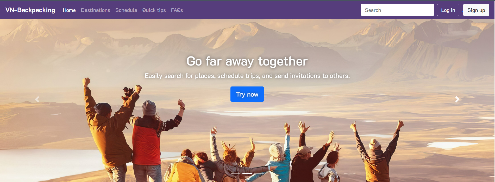
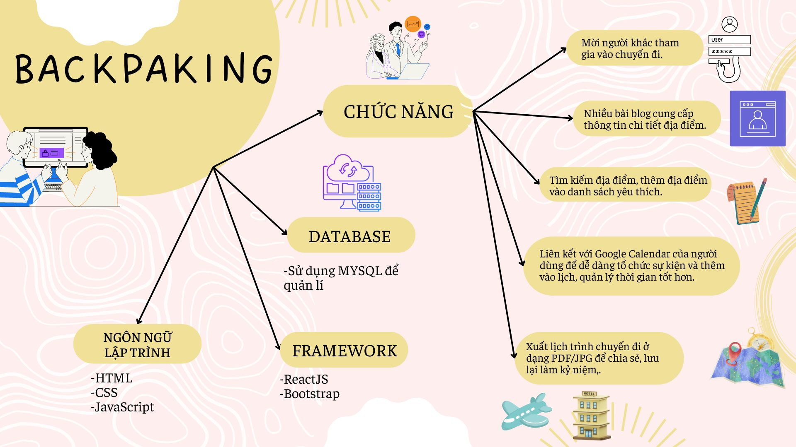

# Vietnam Backpacking Website


## 📝 Introduce:
**Vietnam Backpacking Website** is a basic web programming subject project of group 5, class NT208.O23.ANTT. This is a website that synthesizes places to visit, travel, sightsee extremely chill and supports trip scheduling.

## 👏 Members
- [Phạm Trường Thiên Ân 22520028](https://github.com/ThienAnUIT2022)
- [Nguyễn Hữu Bình 22520132](https://github.com/binhboxbot)
- [Trần Tuấn Anh 22520080](https://github.com/ViWjin)
- [Lăng Thị Cẩm Nhung 22521057](https://github.com/epicycloid55)
- [Phạm Trần Hồng Phúc 22521138](https://github.com/CamNhungJB)

## ⭐ Features

- Search for destinations: (Update soon) Search by area name, place name, destination type or season of the year.
- Add location to favorites list: (Update soon) Add to favorites list to review and schedule trips.
- Blog site for locations: Click "Destinations" on the header bar to go to the blog post summary page, click on any post you are interested in to see detailed content.
- Add trip plans to the Google calendar: Create events in Google Calendar right on the website, easily manage time.
- Invite other users: Invite other users to join the trip for more fun or organize a group trip.
- Export PDF/JPG files: Easily share and save memories

## Contribute
We welcome your contribution to the project. If you would like to contribute, please create a pull request. Before creating a pull request, make sure your code complies with the project's coding conventions and code architecture.

## ⚠️ Error
If you find an error, please create a new issue on GitHub. Or you can contact us via email thienanfa4869@gmail.com and attach your documents. We will try to resolve the issue as soon as possible.

We welcome your constructive contributions.

## ⚓ Start working

1. Clone repository

```console
git clone https://github.com/ThienAnUIT2022/project_web.git
```

2. Create a new branch 

```console
git branch <branch-name>
```
**Note:** Format branch name `Name-StudentID` or `Username`

3. Switch to the newly created branch and work on that branch

```console
git checkout <branch-name>
```

